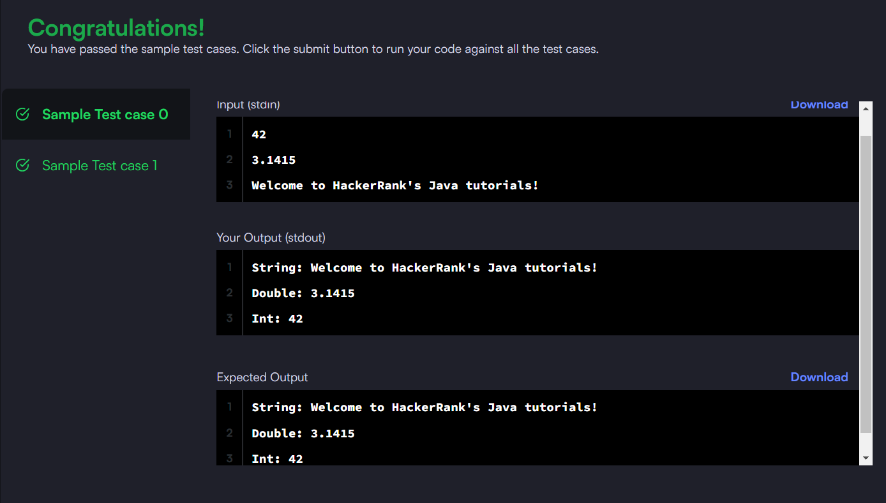

## Task

In this challenge, you must read an integer, a double, and a String from stdin, then print the values according to the instructions in the Output Format section below. To make the problem a little easier, a portion of the code is provided for you in the editor.

**Note:** We recommend completing Java Stdin and Stdout I before attempting this challenge.

### Input Format

There are three lines of input:

- The first line contains an integer.
- The second line contains a double.
- The third line contains a String.

### Output Format

There are three lines of output:

- On the first line, print String: followed by the unaltered String read from stdin.
- On the second line, print Double: followed by the unaltered double read from stdin.
- On the third line, print Int: followed by the unaltered integer read from stdin.
- To make the problem easier, a portion of the code is already provided in the editor.

**Note:** If you use the nextLine() method immediately following the nextInt() method, recall that nextInt() reads integer tokens; because of this, the last newline character for that line of integer input is still queued in the input buffer and the next nextLine() will be reading the remainder of the integer line (which is empty).

### Sample Input

- 42
- 3.1415
- Welcome to HackerRank's Java tutorials!

  ### Sample Output

- String: Welcome to HackerRank's Java tutorials!
- Double: 3.1415
- Int: 42
  
--- 

  ```java
  import java.util.Scanner;

  public class Solution {

    public static void main(String[] args) {
        Scanner scan = new Scanner(System.in);
        int i = scan.nextInt();
        double d = scan.nextDouble();
        scan.nextLine();
        String s = scan.nextLine();
        scan.close();

        // Write your code here.

        System.out.println("String: " + s);
        System.out.println("Double: " + d);
        System.out.println("Int: " + i);
    }
  }

  ```

---



02_Java Stdin and Stdout II/img 1.png
